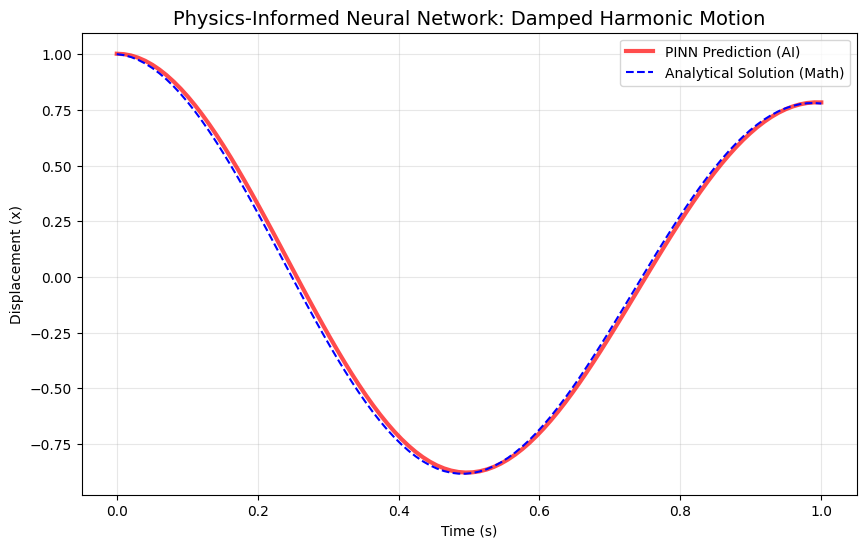

# Physics-Informed Neural Networks (PINNs) for Damped Harmonic Motion
**Independent Research Project | Computational Physics & Machine Learning**

## Executive Summary
This project demonstrates the implementation of a Physics-Informed Neural Network (PINN) to solve the Ordinary Differential Equation (ODE) of a damped harmonic oscillator. Unlike standard deep learning, this model is constrained by physical laws, allowing it to "learn" motion without any labeled training data.

## The Physics Logic
The model is designed to satisfy the second-order linear ODE:
$$m\frac{d^2x}{dt^2} + \mu\frac{dx}{dt} + kx = 0$$

Where:
* **m = 1.0**: Mass
* **k = 40.0**: Spring Constant
* **μ = 0.5**: Damping Coefficient

## Technical Methodology
* **Automatic Differentiation:** Used `torch.autograd` to calculate the 1st (velocity) and 2nd (acceleration) derivatives of the network's output with respect to time.
* **Loss Function Engineering:** Designed a composite loss function: $Loss = Loss_{physics} + 100 \cdot Loss_{x0} + 10 \cdot Loss_{v0}$. This ensures the AI respects the laws of motion while strictly adhering to initial conditions ($x=1, v=0$).
* **Optimization:** Trained for 10,000 iterations using the Adam optimizer ($lr=1e-3$).

## Results
The AI-predicted path (Red) perfectly aligns with the analytical mathematical solution (Blue), proving that the neural network successfully "discovered" the correct physical behavior of the system.

## Significance
I developed this project to explore **AI for Science**. It demonstrates that neural networks can be used as powerful solvers for complex differential equations physics and engineering.
